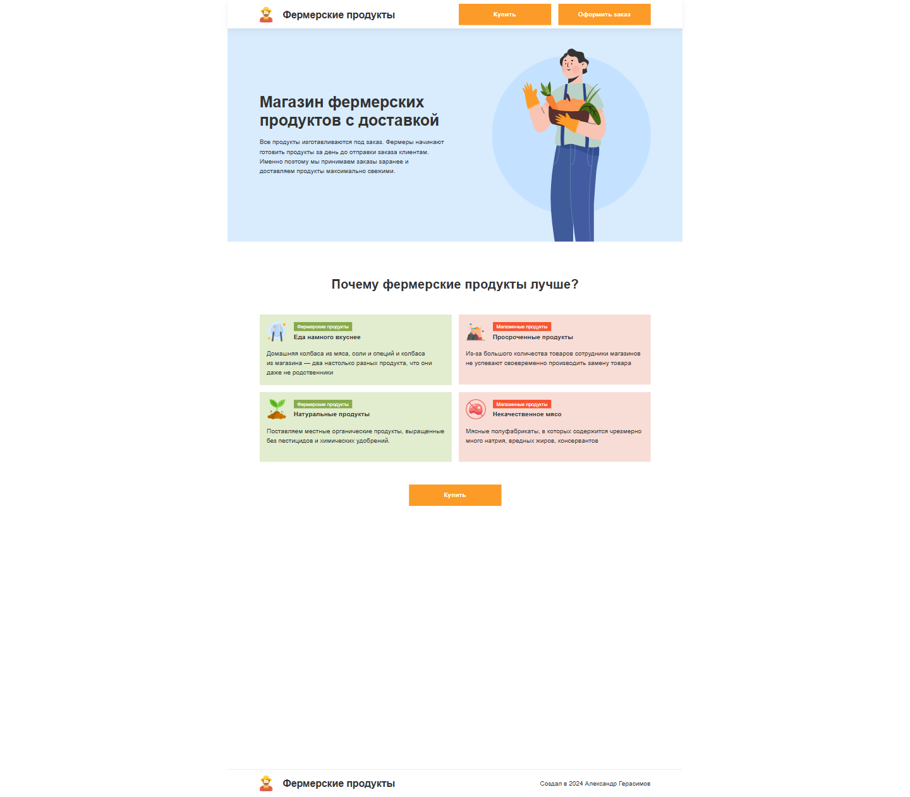
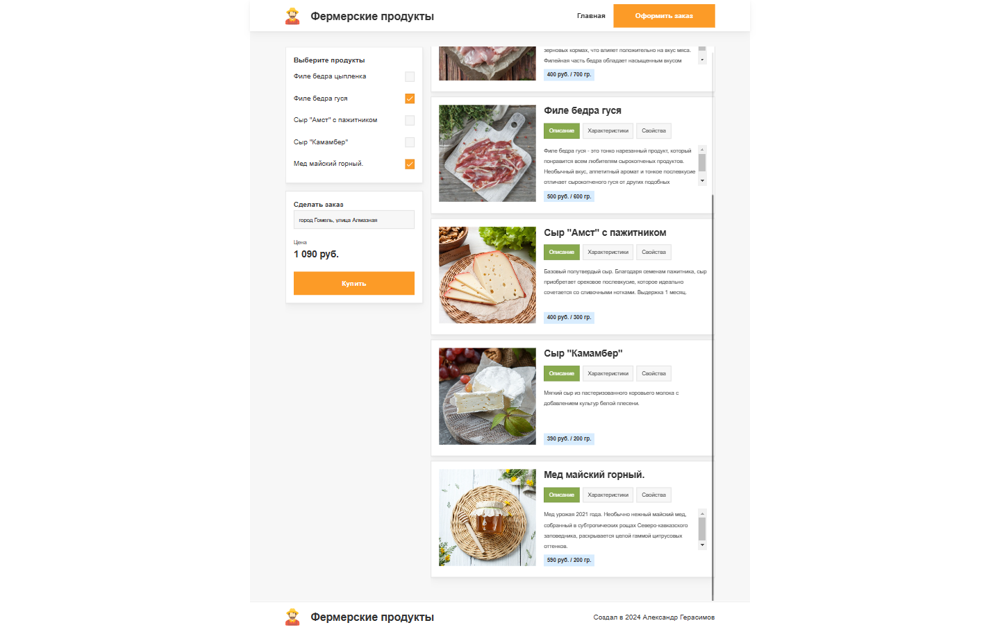

# Личный проект «Интернет-магазин Фермерские продукты»

* Студент: [Александр Герасимов](https://htmlacademy.ru/profile/alexandr-gerasimau).
* Самостоятельное обучение профессии "Фронтенд-разработчик #2" старт - 16 января 2023г., финиш - 26 декабря 2024г.

---

## За время работы над этим проектом изучено
<ul>
  <li>React (синтаксис jsx)</li>
  <li>Верстка простых React-компонентов</li>
  <li>Написание стилей для React-компонентов с помощью styled-component</li>
  <li>Интерактивность в React (управляемые формы, обработчики событий, хуки (useState, useEffect, useRef))</li>
  <li>Список продуктов реализован с помощью пакета Swiper</li>
  <li>Роутинг (react-router-dom)</li>
  <li>Сборка (Create React App)</li>
  <li>Вспомогательные инструменты Node.js и npm</li>
  <li>Работа с Git</li>
</ul>

---

### Запуск и сборка
<ul>
  <li>Установка зависимостей: <code>npm i</code></li>
  <li>Запуск локального сервера: <code>npm run dev</code></li>
  <li>Сборка проекта: <code>npm run build</code></li>
</ul>

---

### Обзор проекта
<a href="https://g-farm-products.netlify.app" target="_blank">«Farm products»</a>

#### Главная страница

#### Страница оформления заказа

